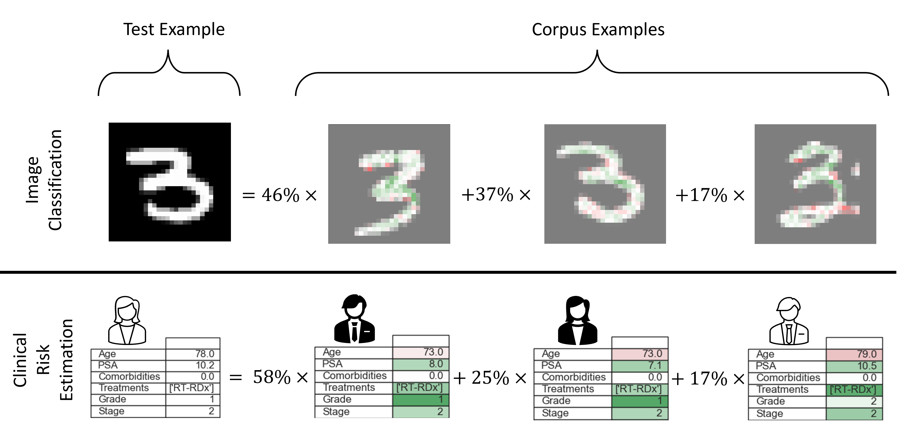

# SimplEx - Explaining Latent Representations with a Corpus of Examples


Code Author: Jonathan Crabbé ([jc2133@cam.ac.uk](mailto:jc2133@cam.ac.uk))

This repository contains the implementation of SimplEx, a method to explain the latent
representations of black-box models with the help of a corpus of examples.
For more details, please read our [NeurIPS 2021 paper](LINK): 'Explaining Latent Representations with a Corpus of Examples'.

## Installation
1. Clone the repository
2. Create a new virtual environment with Python 3.8
3. Run the following command from the repository folder:
    ```shell
    pip install -r requirements.txt #install requirements
    ```
When the packages are installed, SimplEx can directly be used.

## Toy example

Bellow, you can find a toy demonstration where we make a corpus decomposition of test examples representations.
All the relevant code can be found in the file [simplex](explainers/simplex.py).

```python
from explainers.simplex import Simplex
from models.base import BlackBox

# Get the model and the examples
model = BlackBox() # Model should have the BlackBox interface
corpus_inputs = get_corpus() # A tensor of corpus inputs
test_inputs = get_test() # A set of inputs to explain

# Compute the corpus and test latent representations
corpus_latents = model.latent_representation(corpus_inputs) 
test_latents = model.latent_representation(test_inputs)

# Initialize SimplEX, fit it on test examples
simplex = Simplex(corpus_examples=corpus_inputs, 
                  corpus_latent_reps=corpus_latents)
simplex.fit(test_examples=test_inputs, 
            test_latent_reps=test_latents,
            reg_factor=0)

# Get the weights of each corpus decomposition
weights = simplex.weights
```
We get a tensor weights that can be interpreted as follows:
``weights[i,c] = weight of corpus example c in the decomposition of example i``.

We can get the importance of each corpus feature for the decomposition 
of a given example ``i`` in the following way:
```python
# Compute the Integrated Jacobian for a particular example
i = 42
input_baseline = get_baseline() # Baseline tensor of the same shape as corpus_inputs
simplex.jacobian_projections(test_id=i, model=model,
                             input_baseline=input_baseline)

result = simplex.decompose(i)
```
We get a list ``result`` where each element of the list corresponds to a corpus example.
This list is sorted by decreasing order of importance in the corpus decomposition.
Each element of the list is a tuple structured as follows:
```python
w_c, x_c, proj_jacobian_c = result[c]
```
Where ``w_c`` corresponds to the weight ``weights[i,c]``, ``x_c`` corresponds to ``corpus_inputs[c]``
and ``proj_jacobian`` is a tensor such that ``proj_jacobian_c[k]`` is the Projected Jacobian 
of feature ``k`` from corpus example ``c``.


## Reproducing the paper results 
### Reproducing MNIST Approximation Quality Experiment
1. Run the following script for different values of CV (the results from the paper 
   were obtained by taking all integer CV between 0 and 9) 
```shell
python -m experiments.mnist -experiment "approximation_quality" -cv CV

```

2. Run the following script by adding all the values of CV from the previous step
```shell
python -m experiments.results.mnist.quality.plot_results -cv_list CV1 CV2 CV3 ...

```
3. The resulting plots and data are saved [here](experiments/results/mnist/quality).

### Reproducing Prostate Cancer Approximation Quality Experiment
This experiment requires the access to the private datasets CUTRACT 
and SEER decribed in the paper. 
1. Copy the files ``cutract_internal_all.csv`` and ``seer_external_imputed_new.csv`` are in the folder ``data/Prostate Cancer``
2. Run the following script for different values of CV (the results from the paper 
   were obtained by taking all integer CV between 0 and 9) 
```shell
python -m experiments.prostate_cancer -experiment "approximation_quality" -cv CV

```
3. Run the following script by adding all the values of CV from the previous step
```shell
python -m experiments.results.prostate.quality.plot_results -cv_list CV1 CV2 CV3 ...

```
4. The resulting plots are saved [here](experiments/results/prostate/quality).

### Reproducing Prostate Cancer Outlier Experiment
This experiment requires the access to the private datasets CUTRACT 
and SEER decribed in the paper.
1. Make sure that the files ``cutract_internal_all.csv`` and ``seer_external_imputed_new.csv`` are in the folder ``data/Prostate Cancer``
2. Run the following script for different values of CV (the results from the paper 
   were obtained by taking all integer CV between 0 and 9) 
```shell
python -m experiments.prostate_cancer -experiment "outlier_detection" -cv CV

```
3. Run the following script by adding all the values of CV from the previous step
```shell
python -m experiments.results.prostate.outlier.plot_results -cv_list CV1 CV2 CV3 ...

```
4. The resulting plots are saved [here](experiments/results/prostate/outlier).

### Reproducing MNIST Jacobian Projection Significance Experiment
1. Run the following script 
```shell
python -m experiments.mnist -experiment "jacobian_corruption" 

```

2.The resulting plots and data are saved [here](experiments/results/mnist/jacobian_corruption).

### Reproducing MNIST Outlier Detection Experiment
1. Run the following script for different values of CV (the results from the paper 
   were obtained by taking all integer CV between 0 and 9) 
```shell
python -m experiments.mnist -experiment "outlier_detection" -cv CV

```

2. Run the following script by adding all the values of CV from the previous step
```shell
python -m experiments.results.mnist.outlier.plot_results -cv_list CV1 CV2 CV3 ...

```
3. The resulting plots and data are saved [here](experiments/results/mnist/outlier).

### Reproducing MNIST Influence Function Experiment
1. Run the following script for different values of CV (the results from the paper 
   were obtained by taking all integer CV between 0 and 4) 
```shell
python -m experiments.mnist -experiment "influence" -cv CV

```

2. Run the following script by adding all the values of CV from the previous step
```shell
python -m experiments.results.mnist.influence.plot_results -cv_list CV1 CV2 CV3 ...

```
3. The resulting plots and data are saved [here](experiments/results/mnist/influence).

### Reproducing AR Approximation Quality Experiment
1. Run the following script for different values of CV (the results from the paper 
   were obtained by taking all integer CV between 0 and 4) 
```shell
python -m experiments.time_series -experiment "approximation_quality" -cv CV

```

2. Run the following script by adding all the values of CV from the previous step
```shell
python -m experiments.results.ar.quality.plot_results -cv_list CV1 CV2 CV3 ...

```
3. The resulting plots and data are saved [here](experiments/results/ar/quality).

### Reproducing AR Outlier Detection Experiment
1. Run the following script for different values of CV (the results from the paper 
   were obtained by taking all integer CV between 0 and 4) 
```shell
python -m experiments.time_series -experiment "outlier_detection" -cv CV

```

2. Run the following script by adding all the values of CV from the previous step
```shell
python -m experiments.results.ar.outlier.plot_results -cv_list CV1 CV2 CV3 ...

```
3. The resulting plots and data are saved [here](experiments/results/ar/outlier).

## Citing

If you use this code, please cite the associated paper:

```
Put citation here when ready
```
